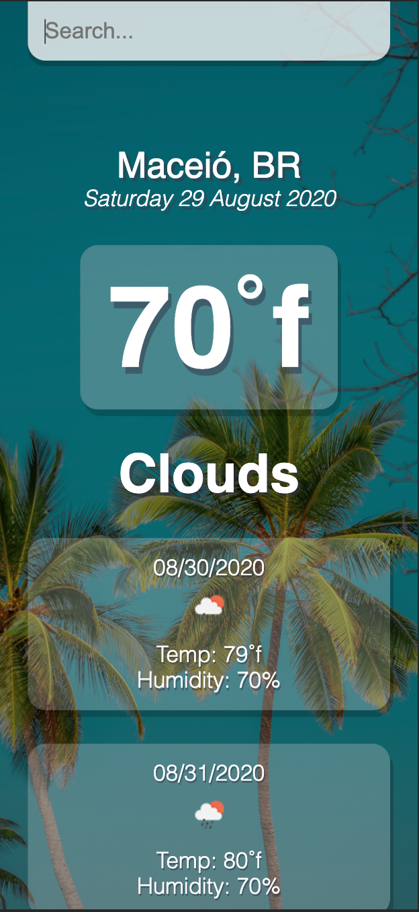
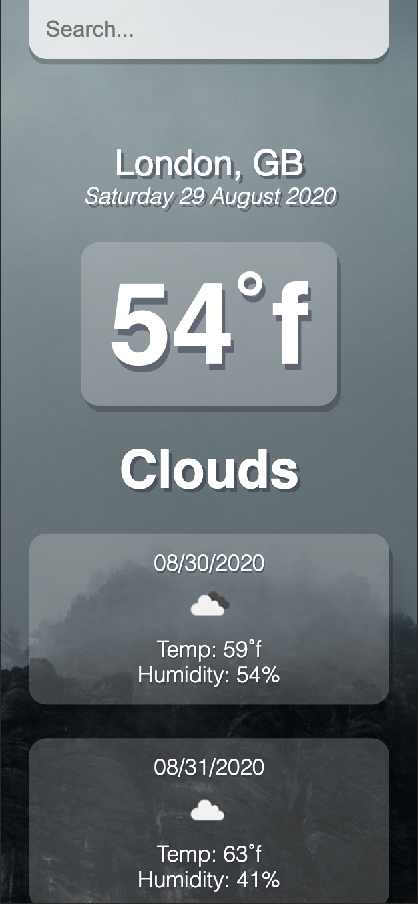

# Weather App

[](https://github.com/ramonpbarros/)

> A mobile-first web application.

## Table of contents

- [General info](#general-info)
- [Screenshots](#screenshots)
- [Technologies](#technologies)
- [Features](#features)
- [Status](#status)
- [Inspiration](#inspiration)
- [Contact](#contact)

## General info

User is able to retrieve weather and forecast information from different cities around the world.

## Screenshots




## Technologies

- React.js
- CSS
- JSX
- OpenWeatherMap API

## Code Examples

Show examples of usage:
```
  fetch(`${api.base}forecast?q=${query}&units=imperial&APPID=${api.key}`)
    .then(res => res.json())
    .then(result => {
      setForecast(result);
      console.log(result)
    });
```
## Features

List of features:

- Search weather forecast by City.
- Clean UI
- Mobile-first design.

To-do list:

- Create landing page.
- Give more information about the weather.
- Add different background images according to the weather.

## Status

Project is: _in progress_

- Check the application [here](https://ramonpbarros.github.io/react-weather/).

## Inspiration

> Project inspired by different weather projects I've seen. I wanted to use my react skills to develop one with a clean design.

## Contact

Created by [@ramonpbarros](https://ramonpbarros.github.io/) - feel free to contact me!
